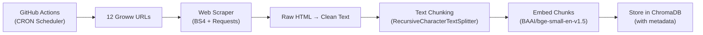
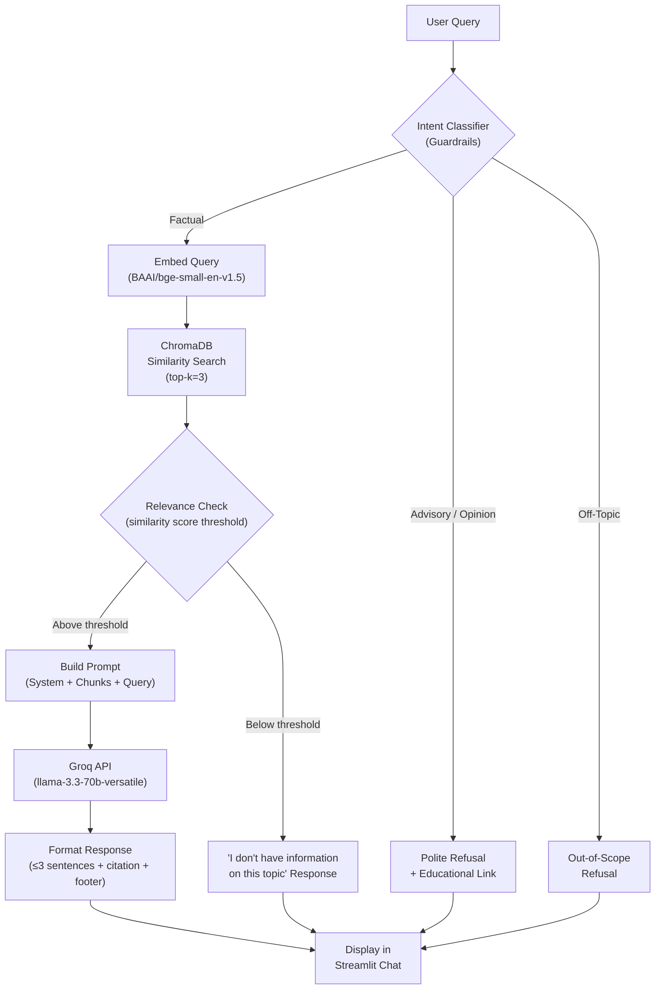
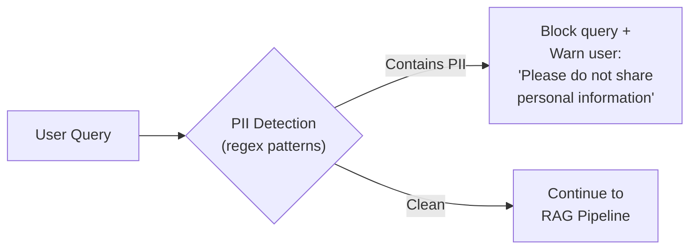

# Architecture Document: Mutual Fund FAQ Assistant

---

## 1. Architecture Overview

This document describes the end-to-end technical architecture of the **Mutual Fund FAQ Assistant** — a Retrieval-Augmented Generation (RAG) chatbot that answers facts-only questions about 12 HSBC mutual fund schemes listed on Groww.

### Design Principles

| Principle | Description |
|---|---|
| **Zero Cost** | Every component in the stack is free — open-source libraries, free-tier APIs, and local computation. No paid services. |
| **Accuracy over Intelligence** | The system retrieves and presents verified facts; it does not reason, advise, or speculate. |
| **Source Transparency** | Every response is grounded in a retrieved document chunk and includes a citation link. |
| **Privacy by Design** | No personal data is collected, stored, or transmitted. |

---

## 2. High-Level Architecture Diagram

```
┌─────────────────────────────────────────────────────────────────────┐
│                         USER INTERFACE                              │
│                     (Streamlit Web App)                              │
│  ┌─────────────┐  ┌──────────────────┐  ┌───────────────────────┐  │
│  │ Welcome Msg  │  │ Example Queries  │  │ Disclaimer Banner     │  │
│  └─────────────┘  └──────────────────┘  └───────────────────────┘  │
│                    ┌──────────────────┐                              │
│                    │   Chat Input     │                              │
│                    └────────┬─────────┘                              │
└─────────────────────────────┼───────────────────────────────────────┘
                              │ User Query
                              ▼
┌─────────────────────────────────────────────────────────────────────┐
│                      QUERY PROCESSING LAYER                         │
│                                                                     │
│  ┌──────────────────────────────────────────────────────────────┐   │
│  │  1. Intent Classifier (Guardrails)                           │   │
│  │     - Factual query? → Continue to retrieval                 │   │
│  │     - Advisory/opinion query? → Trigger polite refusal       │   │
│  │     - Off-topic query? → Trigger out-of-scope refusal        │   │
│  └──────────────────────┬───────────────────────────────────────┘   │
│                         │                                           │
│                         ▼                                           │
│  ┌──────────────────────────────────────────────────────────────┐   │
│  │  2. Query Embedding                                          │   │
│  │     Model: BAAI/bge-small-en-v1.5 (HuggingFace, local)      │   │
│  │     Converts user query → 384-dim vector                     │   │
│  └──────────────────────┬───────────────────────────────────────┘   │
│                         │                                           │
│                         ▼                                           │
│  ┌──────────────────────────────────────────────────────────────┐   │
│  │  3. Semantic Retrieval                                       │   │
│  │     Vector Store: ChromaDB (local, persistent)               │   │
│  │     Returns top-k (k=3) most relevant document chunks        │   │
│  └──────────────────────┬───────────────────────────────────────┘   │
│                         │                                           │
│                         ▼                                           │
│  ┌──────────────────────────────────────────────────────────────┐   │
│  │  4. Answer Generation                                        │   │
│  │     LLM: Groq API (llama-3.3-70b-versatile) — Free Tier     │   │
│  │     Prompt: System prompt + retrieved chunks + user query    │   │
│  │     Output: ≤3 sentences + citation + last-updated footer    │   │
│  └──────────────────────────────────────────────────────────────┘   │
└─────────────────────────────────────────────────────────────────────┘

┌─────────────────────────────────────────────────────────────────────┐
│                     DATA INGESTION PIPELINE                         │
│                       (Automated / Daily)                           │
│                                                                     │
│                ┌──────────────────┐                                 │
│                │  GitHub Actions  │                                 │
│                │   (Scheduler)    │                                 │
│                └────────┬─────────┘                                 │
│                         │ triggers daily                            │
│                         ▼                                           │
│  ┌────────────┐   ┌────────────┐   ┌────────────┐   ┌───────────┐   │
│  │ Web Scraper │──▶│  Chunking  │──▶│ Embedding  │──▶│ ChromaDB  │   │
│  │(BS4 + Req.) │   │ (Recursive │   │ (BAAI/bge) │   │ (Persist) │   │
│  │ 12 URLs     │   │  Splitter) │   │            │   │           │   │
│  └────────────┘   └────────────┘   └────────────┘   └───────────┘   │
└─────────────────────────────────────────────────────────────────────┘
```

---

## 3. Technology Stack

Every tool in this stack is **free to use** — either open-source (runs locally) or has a generous free tier.

### 3.1 Stack Summary

| Layer | Technology | Cost | Reason for Choice |
|---|---|---|---|
| **LLM** | [Groq API](https://console.groq.com/) — `llama-3.3-70b-versatile` | ✅ Free tier | Fastest inference for open models; generous free-tier rate limits (~30 req/min); high-quality 70B parameter model. |
| **Embedding Model** | [BAAI/bge-small-en-v1.5](https://huggingface.co/BAAI/bge-small-en-v1.5) (HuggingFace) | ✅ Free (local) | Top-ranked lightweight embedding model (384 dimensions); runs entirely locally on CPU; no API calls needed. |
| **Vector Store** | [ChromaDB](https://www.trychroma.com/) | ✅ Free (local) | Lightweight, embedded vector database; persistent local storage; simple Python API; perfect for small corpora. |
| **Web Scraping** | [BeautifulSoup4](https://pypi.org/project/beautifulsoup4/) + [Requests](https://pypi.org/project/requests/) | ✅ Free (local) | Standard Python scraping stack; no browser overhead; sufficient for Groww's server-rendered fund pages. |
| **Text Splitting** | [LangChain RecursiveCharacterTextSplitter](https://python.langchain.com/docs/modules/data_connection/document_transformers/) | ✅ Free (local) | Smart recursive splitting that respects paragraph/sentence boundaries; configurable chunk size and overlap. |
| **Orchestration** | [LangChain](https://www.langchain.com/) | ✅ Free (local) | Provides clean abstractions for the RAG chain — retriever, prompt templates, and LLM integration. |
| **UI Framework** | [Streamlit](https://streamlit.io/) | ✅ Free (local + cloud) | Rapid Python-native UI; built-in chat components (`st.chat_message`); free deployment via Streamlit Community Cloud. |
| **Language** | Python 3.10+ | ✅ Free | Standard for ML/NLP/RAG projects; rich ecosystem. |

### 3.2 Groq — LLM Details

| Property | Value |
|---|---|
| **Provider** | Groq Cloud |
| **Model** | `llama-3.3-70b-versatile` |
| **Free Tier Limits** | ~30 requests/min, ~14,400 requests/day, 6,000 tokens/min |
| **Authentication** | API Key (from [console.groq.com](https://console.groq.com/)) |
| **Why Groq?** | Ultra-fast inference (LPU hardware); free tier is sufficient for a demo/resume project; supports top open-source LLMs. |

> **Fallback**: If rate-limited, the system can gracefully show a "Please wait and try again" message. For production, consider caching frequent Q&A pairs.

### 3.3 BAAI/bge-small-en-v1.5 — Embedding Model Details

| Property | Value |
|---|---|
| **Provider** | BAAI (Beijing Academy of Artificial Intelligence) via HuggingFace |
| **Model** | `BAAI/bge-small-en-v1.5` |
| **Dimensions** | 384 |
| **Max Tokens** | 512 |
| **Size** | ~130 MB |
| **Runs Locally** | ✅ Yes — CPU only, no GPU required |
| **Why this model?** | Top-5 on MTEB leaderboard for its size class; lightweight enough for local inference; excellent retrieval quality for a small corpus. |

> **Alternative** (if more accuracy needed): `BAAI/bge-base-en-v1.5` (768 dimensions, ~440 MB) — still free, still local.

---

## 4. Data Ingestion Pipeline

The ingestion pipeline runs **automatically daily** via a GitHub Actions scheduler to ensure the vector store always contains the latest fund data (NAV, expense ratios, etc.).

### 4.1 Pipeline Steps



### 4.2 Step-by-Step Breakdown

#### Step 1: Web Scraping

| Detail | Value |
|---|---|
| **Tool** | `requests` + `BeautifulSoup4` |
| **Input** | 12 Groww mutual fund URLs |
| **Output** | Raw HTML content per fund page |
| **Handling** | Extract relevant sections: fund name, category, expense ratio, exit load, AUM, NAV, minimum investment, riskometer, benchmark, holdings summary, etc. |
| **Error Handling** | Retry with exponential backoff; log failed URLs; skip and continue on persistent failure. |

#### Step 2: Text Cleaning & Structuring

- Strip HTML tags, navigation, ads, and boilerplate.
- Retain only meaningful fund-related content.
- Prefix each document with metadata: `Fund Name`, `Source URL`, `Scrape Date`.
- Output: Clean text documents, one per fund scheme.

#### Step 3: Text Chunking

| Parameter | Value | Rationale |
|---|---|---|
| **Splitter** | `RecursiveCharacterTextSplitter` | Respects natural boundaries (paragraphs → sentences → words). |
| **Chunk Size** | 500 characters | Small enough for precise retrieval; large enough to retain context. |
| **Chunk Overlap** | 50 characters | Prevents information loss at chunk boundaries. |
| **Separators** | `["\n\n", "\n", ". ", " "]` | Splits on paragraphs first, then sentences. |

#### Step 4: Embedding

- Each chunk is passed through `BAAI/bge-small-en-v1.5` locally.
- Output: 384-dimensional dense vector per chunk.
- **Prefix for retrieval**: Prepend `"Represent this sentence for searching relevant passages: "` to the query (as recommended by BAAI for asymmetric retrieval tasks).

#### Step 5: Vector Storage

| Detail | Value |
|---|---|
| **Database** | ChromaDB (persistent mode) |
| **Collection Name** | `mutual_fund_faq` |
| **Stored Per Chunk** | Embedding vector, chunk text, metadata (fund_name, source_url, scrape_date, chunk_id) |
| **Persistence** | Local directory (`./chroma_db/`) — survives app restarts. |

---

## 5. Query Processing Pipeline

This is the **runtime pipeline** that handles each user query.

### 5.1 Pipeline Flow



### 5.2 Intent Classification (Guardrails)

The intent classifier runs **before** retrieval to filter out non-factual queries cheaply.

| Approach | Details |
|---|---|
| **Method** | Keyword + pattern matching (primary) with LLM-based fallback |
| **Advisory Triggers** | Keywords: "should I", "recommend", "better", "best", "worth it", "suggest", "advice", "opinion", "which fund", "compare" |
| **Off-Topic Triggers** | Queries not related to mutual funds at all |
| **Implementation** | Python function with regex patterns; optionally enhanced via a lightweight Groq classification call |

> **Why not use the LLM for all classification?** To conserve Groq free-tier rate limits. Keyword matching handles 80%+ of refusal cases without an API call.

### 5.3 Retrieval Configuration

| Parameter | Value | Rationale |
|---|---|---|
| **Top-K** | 3 | Sufficient for a focused corpus of 12 funds; keeps prompt short and LLM context small. |
| **Distance Metric** | Cosine similarity | Standard for dense retrieval with normalized embeddings. |
| **Relevance Threshold** | 0.5 (cosine similarity) | Chunks below this threshold are considered irrelevant — triggers a "no information available" response. |

### 5.4 Prompt Engineering

The system prompt is the core control mechanism for response quality and compliance.

```
SYSTEM PROMPT (Simplified):
───────────────────────────────────
You are a facts-only mutual fund FAQ assistant. You answer questions
using ONLY the provided context. Follow these rules strictly:

1. Answer in a maximum of 3 sentences.
2. Include exactly ONE source citation link from the context metadata.
3. End every response with: "Last updated from sources: <date>"
4. NEVER provide investment advice, opinions, or recommendations.
5. NEVER compare funds or calculate returns.
6. If the context does not contain the answer, say:
   "I don't have this information in my current sources."
7. For performance-related queries, provide only the official
   factsheet link.

CONTEXT:
{retrieved_chunks}

USER QUESTION:
{user_query}
───────────────────────────────────
```

### 5.5 Response Post-Processing

After the LLM generates a response:

1. **Validate sentence count** — truncate if >3 sentences.
2. **Ensure citation link** — append the source URL from the top retrieved chunk's metadata if the LLM omitted it.
3. **Append footer** — `"Last updated from sources: <scrape_date>"`.

---

## 6. User Interface Architecture

### 6.1 Technology: Streamlit

| Feature | Implementation |
|---|---|
| **Framework** | Streamlit (Python) |
| **Chat UI** | `st.chat_message()` + `st.chat_input()` — native chat components |
| **State Management** | `st.session_state` for chat history |
| **Deployment** | Local (`streamlit run app.py`) or [Streamlit Community Cloud](https://streamlit.io/cloud) (free) |

### 6.2 UI Components

```
┌─────────────────────────────────────────────────┐
│  🏦 Mutual Fund FAQ Assistant                   │
│                                                  │
│  ┌──────────────────────────────────────────┐   │
│  │ ⚠️ Facts-only. No investment advice.     │   │
│  └──────────────────────────────────────────┘   │
│                                                  │
│  👋 Welcome! I can answer factual questions     │
│  about HSBC mutual fund schemes on Groww.       │
│                                                  │
│  Try asking:                                     │
│  ┌──────────────────────────────────────────┐   │
│  │ "What is the expense ratio of HSBC       │   │
│  │  Midcap Fund?"                           │   │
│  ├──────────────────────────────────────────┤   │
│  │ "What is the exit load for HSBC Small    │   │
│  │  Cap Fund?"                              │   │
│  ├──────────────────────────────────────────┤   │
│  │ "What is the minimum SIP amount for      │   │
│  │  HSBC ELSS Fund?"                        │   │
│  └──────────────────────────────────────────┘   │
│                                                  │
│  ┌──────────────────────────────────────────┐   │
│  │ 🧑 User: What is the exit load for HSBC │   │
│  │         Midcap Fund?                     │   │
│  ├──────────────────────────────────────────┤   │
│  │ 🤖 Bot: The exit load for HSBC Midcap   │   │
│  │ Fund Direct Growth is 1% if redeemed     │   │
│  │ within 1 year from the date of allotment.│   │
│  │                                          │   │
│  │ Source: https://groww.in/mutual-funds/   │   │
│  │ hsbc-midcap-fund-direct-growth           │   │
│  │                                          │   │
│  │ Last updated from sources: 2026-07-01    │   │
│  └──────────────────────────────────────────┘   │
│                                                  │
│  ┌──────────────────────────────────────────┐   │
│  │ Type your question...              [Send]│   │
│  └──────────────────────────────────────────┘   │
└─────────────────────────────────────────────────┘
```

---

## 7. Project Directory Structure

```
Chatbot FAQ Final/
│
├── Docs/
│   ├── Problemstatement.txt        # Original problem statement
│   ├── context.md                  # Project context document
│   └── Architecture.md             # This document
│
├── src/
│   ├── scraper.py                  # Web scraping module (BS4 + Requests)
│   ├── ingestion.py                # Chunking + embedding + ChromaDB storage
│   ├── retriever.py                # Semantic search over ChromaDB
│   ├── guardrails.py               # Intent classification & refusal logic
│   ├── chain.py                    # LangChain RAG chain (prompt + Groq LLM)
│   └── config.py                   # Centralized configuration (constants, prompts)
│
├── app.py                          # Streamlit application entry point
├── requirements.txt                # Python dependencies
├── .env                            # Environment variables (GROQ_API_KEY)
├── .env.example                    # Template for .env
├── .gitignore                      # Git ignore rules
├── README.md                       # Setup instructions & project overview
│
├── chroma_db/                      # Persistent ChromaDB storage (auto-generated)
│
└── data/
    └── scraped/                    # Raw scraped text files (optional cache)
```

---

## 8. Key Dependencies

All packages are open-source and freely available via `pip`.

```txt
# requirements.txt

streamlit>=1.35.0            # Web UI framework
langchain>=0.2.0             # RAG orchestration
langchain-community>=0.2.0   # Community integrations (ChromaDB, HuggingFace)
langchain-groq>=0.1.0        # Groq LLM integration for LangChain
chromadb>=0.5.0              # Vector database (local, persistent)
sentence-transformers>=3.0.0 # HuggingFace embedding models (BAAI/bge)
beautifulsoup4>=4.12.0       # HTML parsing for web scraping
requests>=2.31.0             # HTTP client for scraping
python-dotenv>=1.0.0         # .env file loading for API keys
```

---

## 9. Environment Variables

The only secret required is the **Groq API key** (free to obtain).

```bash
# .env
GROQ_API_KEY=gsk_your_groq_api_key_here
```

| Variable | Source | Cost |
|---|---|---|
| `GROQ_API_KEY` | [console.groq.com](https://console.groq.com/) → API Keys | ✅ Free |

> No other API keys, subscriptions, or paid services are required.

---

## 10. Deployment Options

| Option | Cost | Details |
|---|---|---|
| **Local** | ✅ Free | `streamlit run app.py` — runs on localhost. |
| **Streamlit Community Cloud** | ✅ Free | Connect GitHub repo → auto-deploy. Free tier includes 1 app with public access. |
| **Hugging Face Spaces** | ✅ Free | Deploy as a Streamlit app on HF Spaces (2 vCPU, 16 GB RAM free tier). |

> **Recommended for resume**: Deploy on **Streamlit Community Cloud** — easy, free, gives you a shareable public URL.

---

## 11. Security & Privacy Architecture



### PII Detection Patterns

| Data Type | Detection Method |
|---|---|
| PAN Number | Regex: `[A-Z]{5}[0-9]{4}[A-Z]` |
| Aadhaar Number | Regex: `[0-9]{4}\s?[0-9]{4}\s?[0-9]{4}` |
| Phone Number | Regex: `(\+91)?[6-9][0-9]{9}` |
| Email Address | Regex: Standard email pattern |
| Account Number | Regex: Long numeric sequences (10+ digits) |

> Queries containing detected PII are **blocked before reaching the LLM** — the data is never sent to Groq.

---

## 12. Error Handling & Edge Cases

| Scenario | Handling Strategy |
|---|---|
| **Groq rate limit exceeded** | Display: "I'm a bit busy right now. Please try again in a minute." Cache frequent Q&A pairs locally to reduce API calls. |
| **Scraping failure** | Log the failed URL; continue ingestion for remaining URLs; surface a warning in the admin console. |
| **No relevant chunks found** | If all retrieved chunks have similarity score < threshold, respond: "I don't have information on this topic in my current sources." |
| **LLM hallucination safeguard** | System prompt explicitly instructs: "Answer ONLY from the provided context. If the answer is not in the context, say so." |
| **Ambiguous query** | Retrieve and answer if a match is found; otherwise, ask: "Could you specify which HSBC fund you're asking about?" |
| **Network failure** | Graceful error message in UI; local ChromaDB still serves cached data. |

---

## 13. Cost Summary

| Component | Service | Monthly Cost |
|---|---|---|
| LLM Inference | Groq Free Tier | **$0** |
| Embeddings | BAAI/bge-small-en-v1.5 (local) | **$0** |
| Vector Database | ChromaDB (local) | **$0** |
| Web Scraping | BeautifulSoup + Requests (local) | **$0** |
| UI Framework | Streamlit (local / Community Cloud) | **$0** |
| Hosting | Streamlit Community Cloud / HF Spaces | **$0** |
| **Total** | | **$0/month** |

---

## 14. Known Limitations

| Limitation | Mitigation |
|---|---|
| **Groq free-tier rate limits** | Cache frequent responses; implement retry with backoff; sufficient for demo/resume traffic. |
| **Corpus is static** | Mitigated by **GitHub Actions Scheduler** (Phase 9) which automatically re-scrapes data daily and updates ChromaDB. |
| **Single AMC coverage** | Only HSBC funds are covered. Architecture supports adding more AMCs by extending the URL list. |
| **No real-time NAV** | NAV data is as of the last daily scrape. For live NAV, link to the Groww page directly. |
| **English only** | BAAI/bge-small-en-v1.5 is an English model. Hindi/regional language support would require a multilingual embedding model. |
| **No auth / multi-user state** | Streamlit session state is per-browser-tab. No user accounts or persistent chat history across sessions. |

---

> *Derived from: [context.md](file:///c:/Chatbot%20FAQ%20Final/Docs/context.md) · [Problemstatement.txt](file:///c:/Chatbot%20FAQ%20Final/Docs/Problemstatement.txt)*
