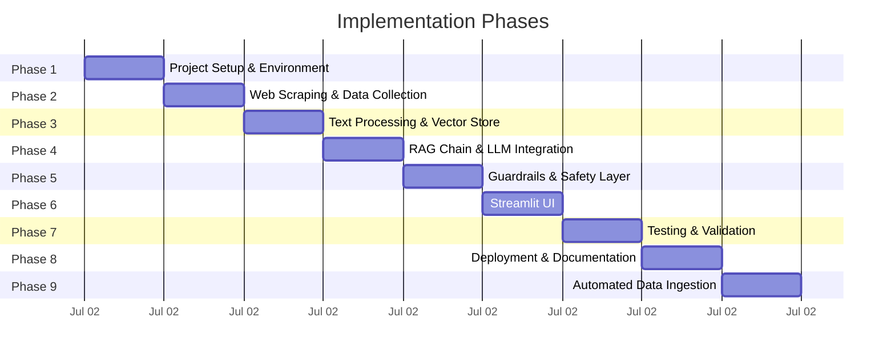
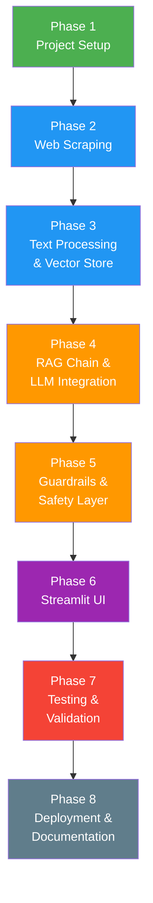

# Implementation Plan: Mutual Fund FAQ Assistant

> Phase-wise implementation guide derived from the [Architecture Document](file:///c:/Chatbot%20FAQ%20Final/Docs/Architecture.md).

---

## Implementation Roadmap — Overview



| Phase | Name | Estimated Duration | Key Output |
|---|---|---|---|
| 1 | Project Setup & Environment | ~1 hour | Working Python env, directory structure, dependencies installed |
| 2 | Web Scraping & Data Collection | ~1 hour | 12 clean text files, one per HSBC fund scheme |
| 3 | Text Processing & Vector Store | ~1 hour | ChromaDB populated with embedded chunks |
| 4 | RAG Chain & LLM Integration | ~1 hour | End-to-end query → answer pipeline working in terminal |
| 5 | Guardrails & Safety Layer | ~1 hour | Intent classifier + PII blocker + refusal templates |
| 6 | Streamlit UI | ~1 hour | Fully functional chat interface |
| 7 | Testing & Validation | ~1 hour | Test suite, edge case validation, prompt tuning |
| 8 | Deployment & Documentation | ~1 hour | Live app + README + final docs |
| 9 | Automated Data Ingestion | ~1 hour | GitHub Actions cron job for daily scraper trigger |

> **Total estimated time**: 1 day (Rapid Implementation)

---

---

# Phase 1: Project Setup & Environment

**Goal**: Establish the project foundation — directory structure, Python environment, all dependencies, and configuration files.

---

## 1.1 Create Directory Structure

Create the following folder layout inside the project root:

```
Chatbot FAQ Final/
│
├── Docs/
│   ├── Problemstatement.txt        # (Already exists)
│   ├── context.md                  # (Already exists)
│   ├── Architecture.md             # (Already exists)
│   └── Implementation.md           # (This document)
│
├── src/
│   ├── __init__.py                 # Makes src a Python package
│   ├── config.py                   # Centralized constants, prompts, URLs
│   ├── scraper.py                  # Web scraping module
│   ├── ingestion.py                # Text processing + ChromaDB storage
│   ├── retriever.py                # Semantic search over ChromaDB
│   ├── guardrails.py               # Intent classification & refusal logic
│   └── chain.py                    # LangChain RAG chain (prompt + Groq)
│
├── data/
│   └── scraped/                    # Cached scraped text files
│
├── chroma_db/                      # ChromaDB persistent storage (auto-created)
│
├── tests/
│   ├── __init__.py
│   ├── test_scraper.py
│   ├── test_guardrails.py
│   ├── test_retriever.py
│   └── test_chain.py
│
├── app.py                          # Streamlit entry point
├── requirements.txt                # Python dependencies
├── .env                            # API keys (git-ignored)
├── .env.example                    # Template for .env
├── .gitignore                      # Git ignore rules
└── README.md                       # Project documentation
```

### Actions

- [ ] Create all directories: `src/`, `data/scraped/`, `tests/`
- [ ] Create empty `__init__.py` files in `src/` and `tests/`
- [ ] Remaining files will be created in subsequent phases

---

## 1.2 Initialize Python Environment

```bash
# Create virtual environment
python -m venv venv

# Activate (Windows PowerShell)
.\venv\Scripts\Activate.ps1

# Activate (Linux/Mac)
source venv/bin/activate
```

---

## 1.3 Create `requirements.txt`

```txt
# Core
streamlit>=1.35.0
langchain>=0.2.0
langchain-community>=0.2.0
langchain-groq>=0.1.0

# Vector DB & Embeddings
chromadb>=0.5.0
sentence-transformers>=3.0.0

# Web Scraping
beautifulsoup4>=4.12.0
requests>=2.31.0

# Config
python-dotenv>=1.0.0

# Testing
pytest>=8.0.0
```

```bash
# Install all dependencies
pip install -r requirements.txt
```

---

## 1.4 Create `.env.example` and `.env`

**.env.example** (committed to git):
```bash
# Groq API Key — get yours free at https://console.groq.com/
GROQ_API_KEY=gsk_your_api_key_here
```

**.env** (git-ignored, actual key):
```bash
GROQ_API_KEY=gsk_xxxxxxxxxxxxxxxxxxxxxxxxxxxxxxxx
```

> **How to get the key**: Go to [console.groq.com](https://console.groq.com/) → Sign up (free) → API Keys → Create API Key → Copy.

---

## 1.5 Create `.gitignore`

```gitignore
# Environment
venv/
.env

# ChromaDB
chroma_db/

# Python
__pycache__/
*.pyc
*.pyo
.pytest_cache/

# IDE
.vscode/
.idea/

# OS
.DS_Store
Thumbs.db

# Scraped data cache
data/scraped/*.txt
```

---

## 1.6 Create `src/config.py`

This file centralizes all constants, URLs, prompts, and configuration values used across the project.

```python
"""Centralized configuration for the Mutual Fund FAQ Assistant."""

import os
from dotenv import load_dotenv

load_dotenv()

# ─── API Keys ───────────────────────────────────────────────
GROQ_API_KEY = os.getenv("GROQ_API_KEY")

# ─── LLM Configuration ─────────────────────────────────────
LLM_MODEL = "llama-3.3-70b-versatile"
LLM_TEMPERATURE = 0.1  # Low temperature for factual accuracy
LLM_MAX_TOKENS = 300

# ─── Embedding Model ───────────────────────────────────────
EMBEDDING_MODEL = "BAAI/bge-small-en-v1.5"
EMBEDDING_DIMENSIONS = 384

# ─── ChromaDB ──────────────────────────────────────────────
CHROMA_PERSIST_DIR = "./chroma_db"
CHROMA_COLLECTION_NAME = "mutual_fund_faq"

# ─── Retrieval ─────────────────────────────────────────────
TOP_K = 3
RELEVANCE_THRESHOLD = 0.5  # Cosine similarity

# ─── Text Chunking ─────────────────────────────────────────
CHUNK_SIZE = 500
CHUNK_OVERLAP = 50
CHUNK_SEPARATORS = ["\n\n", "\n", ". ", " "]

# ─── Corpus URLs ───────────────────────────────────────────
FUND_URLS = [
    "https://groww.in/mutual-funds/hsbc-midcap-fund-direct-growth",
    "https://groww.in/mutual-funds/hsbc-multi-cap-fund-direct-growth",
    "https://groww.in/mutual-funds/hsbc-small-cap-fund-direct-growth",
    "https://groww.in/mutual-funds/hsbc-india-opportunities-fund-direct-growth",
    "https://groww.in/mutual-funds/hsbc-credit-risk-fund-direct-growth",
    "https://groww.in/mutual-funds/hsbc-focused-fund-direct-growth",
    "https://groww.in/mutual-funds/hsbc-consumption-fund-direct-growth",
    "https://groww.in/mutual-funds/hsbc-gold-etf-fof-direct-growth",
    "https://groww.in/mutual-funds/hsbc-elss-fund-direct-growth",
    "https://groww.in/mutual-funds/hsbc-infrastructure-fund-direct-growth",
    "https://groww.in/mutual-funds/hsbc-equity-hybrid-fund-direct-growth",
    "https://groww.in/mutual-funds/hsbc-liquid-fund-direct-growth",
]

# ─── Scraped Data Cache ───────────────────────────────────
SCRAPED_DATA_DIR = "./data/scraped"

# ─── Guardrails — Advisory Keywords ───────────────────────
ADVISORY_KEYWORDS = [
    "should i", "recommend", "better", "best", "worth it",
    "suggest", "advice", "opinion", "which fund", "compare",
    "invest in", "buy", "sell", "hold", "good fund", "bad fund",
    "profitable", "returns will", "predict", "forecast",
]

# ─── System Prompt ─────────────────────────────────────────
SYSTEM_PROMPT = """You are a facts-only mutual fund FAQ assistant. You answer questions using ONLY the provided context. Follow these rules strictly:

1. Answer in a maximum of 3 sentences.
2. Include exactly ONE source citation link from the context metadata.
3. End every response with: "Last updated from sources: {scrape_date}"
4. NEVER provide investment advice, opinions, or recommendations.
5. NEVER compare funds or calculate returns.
6. If the context does not contain the answer, say: "I don't have this information in my current sources."
7. For performance-related queries, provide only the official factsheet link.
8. Be concise, accurate, and professional.

CONTEXT:
{context}

USER QUESTION:
{question}"""

# ─── Refusal Templates ─────────────────────────────────────
ADVISORY_REFUSAL = (
    "I'm a facts-only assistant and cannot provide investment advice, "
    "opinions, or fund comparisons. For guidance on choosing mutual funds, "
    "you can visit the AMFI investor education page: "
    "https://www.amfiindia.com/investor-corner/knowledge-center.html\n\n"
    "*Last updated from sources: {scrape_date}*"
)

OFF_TOPIC_REFUSAL = (
    "I can only answer factual questions about HSBC mutual fund schemes "
    "available on Groww. Please ask about expense ratios, exit loads, "
    "SIP amounts, risk levels, or other fund details.\n\n"
    "*Last updated from sources: {scrape_date}*"
)

PII_WARNING = (
    "⚠️ Please do not share personal information such as PAN, Aadhaar, "
    "account numbers, phone numbers, or email addresses. "
    "I do not collect or process personal data."
)

NO_RESULTS_RESPONSE = (
    "I don't have information on this topic in my current sources. "
    "Please try rephrasing your question or ask about a specific "
    "HSBC mutual fund scheme.\n\n"
    "*Last updated from sources: {scrape_date}*"
)
```

---

## 1.7 Phase 1 — Verification Checklist

| # | Check | Command / Action |
|---|---|---|
| 1 | Virtual environment activates | `.\venv\Scripts\Activate.ps1` |
| 2 | All packages install without errors | `pip install -r requirements.txt` |
| 3 | Groq API key loads correctly | `python -c "from src.config import GROQ_API_KEY; print(GROQ_API_KEY[:10])"` |
| 4 | Directory structure is correct | `tree /F` (Windows) or `find . -type f` (Linux) |
| 5 | `.gitignore` excludes `.env`, `venv/`, `chroma_db/` | `git status` — confirm they don't appear |

---

---

# Phase 2: Web Scraping & Data Collection

**Goal**: Scrape all 12 HSBC fund pages from Groww, extract meaningful content, clean the HTML, and save as structured text files.

---

## 2.1 Module: `src/scraper.py`

### Responsibilities

| Responsibility | Details |
|---|---|
| Fetch HTML | `requests.get()` with headers, retries, and exponential backoff |
| Parse HTML | `BeautifulSoup` to extract fund-relevant sections |
| Clean text | Strip navigation, ads, scripts, boilerplate |
| Structure output | Prefix each document with metadata (fund name, URL, scrape date) |
| Save to disk | Write clean text to `data/scraped/<fund-slug>.txt` |
| Error handling | Log failures; skip and continue; report summary |

### Key Implementation Details

#### HTTP Request Headers

```python
HEADERS = {
    "User-Agent": "Mozilla/5.0 (Windows NT 10.0; Win64; x64) "
                  "AppleWebKit/537.36 (KHTML, like Gecko) "
                  "Chrome/120.0.0.0 Safari/537.36",
    "Accept": "text/html,application/xhtml+xml,application/xml;q=0.9",
    "Accept-Language": "en-US,en;q=0.9",
}
```

> **Why custom headers?** Some sites block the default `python-requests` User-Agent. Mimic a real browser to avoid 403 errors.

#### Data Extraction Strategy

Groww fund pages typically contain these sections to target:

| Section | Content to Extract |
|---|---|
| **Fund Header** | Fund name, category, sub-category |
| **NAV & Returns** | Current NAV, NAV date (do NOT extract return percentages — facts only) |
| **Fund Details Table** | Expense ratio, exit load, minimum SIP, minimum lumpsum, benchmark index, fund manager, AUM, launch date |
| **Riskometer** | Risk classification (Low / Moderate / High, etc.) |
| **Investment Objective** | Fund's stated objective |
| **Asset Allocation** | Equity %, Debt %, Cash %, etc. |
| **Holdings** | Top holdings and sectors (if available) |
| **Tax Information** | ELSS lock-in period, LTCG/STCG classification |

#### Output Format (per fund)

```text
Fund Name: HSBC Midcap Fund Direct Growth
Source URL: https://groww.in/mutual-funds/hsbc-midcap-fund-direct-growth
Scrape Date: 2026-07-02

Category: Equity - Mid Cap
Risk Level: Very High

NAV: ₹245.32 (as of 01-Jul-2026)

Expense Ratio: 0.69%
Exit Load: 1% if redeemed within 1 year
Minimum SIP: ₹500
Minimum Lumpsum: ₹5,000
Benchmark: Nifty Midcap 150 TRI
Fund Manager: Gautam Bhupal
AUM: ₹12,345 Cr
Launch Date: 24-Feb-2004

Investment Objective:
The fund seeks long term capital growth by investing in a portfolio of...

Asset Allocation:
Equity: 97.5%, Debt: 0%, Cash & Others: 2.5%

Top Holdings:
1. ABC Ltd - 3.2%
2. XYZ Corp - 2.8%
...
```

#### Retry Logic with Exponential Backoff

```python
import time
import requests

def fetch_with_retry(url, max_retries=3, base_delay=2):
    """Fetch URL with exponential backoff on failure."""
    for attempt in range(max_retries):
        try:
            response = requests.get(url, headers=HEADERS, timeout=15)
            response.raise_for_status()
            return response
        except requests.RequestException as e:
            if attempt < max_retries - 1:
                delay = base_delay * (2 ** attempt)
                print(f"  Retry {attempt + 1}/{max_retries} in {delay}s: {e}")
                time.sleep(delay)
            else:
                print(f"  FAILED after {max_retries} attempts: {url}")
                return None
```

#### Main Scraper Function (Pseudocode)

```python
def scrape_all_funds():
    """Scrape all 12 fund URLs and save clean text files."""
    results = {"success": [], "failed": []}

    for url in FUND_URLS:
        slug = url.split("/")[-1]  # e.g., "hsbc-midcap-fund-direct-growth"
        print(f"Scraping: {slug}...")

        response = fetch_with_retry(url)
        if not response:
            results["failed"].append(slug)
            continue

        soup = BeautifulSoup(response.text, "html.parser")
        clean_text = extract_fund_data(soup, url)
        save_to_file(slug, clean_text)
        results["success"].append(slug)

        time.sleep(1)  # Polite delay between requests

    print(f"\nDone: {len(results['success'])} success, {len(results['failed'])} failed")
    return results
```

---

## 2.2 Handling Dynamic Content (Fallback)

If Groww pages are heavily JavaScript-rendered and `requests` + `BeautifulSoup` cannot extract the data:

| Fallback Strategy | Details |
|---|---|
| **Option A**: Selenium (headless) | Use `selenium` with headless Chrome to render JS. Heavier but guaranteed to work. Free. |
| **Option B**: Manual curation | Manually copy fund data from Groww into text files. Fastest for 12 pages. Most reliable. |
| **Option C**: Groww API (if available) | Check if Groww exposes a public API for fund data. Cleaner but undocumented. |

> **Recommendation**: Try `requests` first. If it fails for most pages, fall back to manual curation (Option B) — for 12 funds, this takes ~30 minutes and guarantees clean data.

---

## 2.3 Phase 2 — Verification Checklist

| # | Check | How to Verify |
|---|---|---|
| 1 | All 12 text files created in `data/scraped/` | `dir data\scraped\` — should show 12 `.txt` files |
| 2 | Each file has metadata header | Open any file — first 3 lines should be Fund Name, Source URL, Scrape Date |
| 3 | Content is clean (no HTML tags) | Grep for `<` or `>` — should return nothing |
| 4 | Key fields present | Each file should contain: expense ratio, exit load, min SIP, risk level, benchmark |
| 5 | No sensitive/PII data in files | Files contain only publicly available fund information |

---

---

# Phase 3: Text Processing & Vector Store

**Goal**: Chunk the scraped documents, embed them using BAAI/bge-small-en-v1.5, and store in ChromaDB for semantic retrieval.

---

## 3.1 Module: `src/ingestion.py`

### Responsibilities

| Responsibility | Details |
|---|---|
| Load scraped text files | Read all `.txt` files from `data/scraped/` |
| Extract metadata | Parse fund name, source URL, scrape date from file headers |
| Chunk text | Split using `RecursiveCharacterTextSplitter` (500 chars, 50 overlap) |
| Embed chunks | Use `BAAI/bge-small-en-v1.5` via `sentence-transformers` locally |
| Store in ChromaDB | Persist embeddings + text + metadata to `./chroma_db/` |

### Step-by-Step Implementation

#### Step 1: Load Documents

```python
import os
from datetime import datetime

def load_scraped_documents(scraped_dir="./data/scraped"):
    """Load all scraped text files and extract metadata."""
    documents = []

    for filename in sorted(os.listdir(scraped_dir)):
        if not filename.endswith(".txt"):
            continue

        filepath = os.path.join(scraped_dir, filename)
        with open(filepath, "r", encoding="utf-8") as f:
            content = f.read()

        # Extract metadata from first 3 lines
        lines = content.split("\n")
        fund_name = lines[0].replace("Fund Name: ", "").strip()
        source_url = lines[1].replace("Source URL: ", "").strip()
        scrape_date = lines[2].replace("Scrape Date: ", "").strip()

        documents.append({
            "content": content,
            "metadata": {
                "fund_name": fund_name,
                "source_url": source_url,
                "scrape_date": scrape_date,
                "filename": filename,
            }
        })

    print(f"Loaded {len(documents)} documents")
    return documents
```

#### Step 2: Chunk Documents

```python
from langchain.text_splitter import RecursiveCharacterTextSplitter
from src.config import CHUNK_SIZE, CHUNK_OVERLAP, CHUNK_SEPARATORS

def chunk_documents(documents):
    """Split documents into chunks, preserving metadata."""
    splitter = RecursiveCharacterTextSplitter(
        chunk_size=CHUNK_SIZE,
        chunk_overlap=CHUNK_OVERLAP,
        separators=CHUNK_SEPARATORS,
        length_function=len,
    )

    all_chunks = []
    for doc in documents:
        chunks = splitter.split_text(doc["content"])
        for i, chunk_text in enumerate(chunks):
            all_chunks.append({
                "text": chunk_text,
                "metadata": {
                    **doc["metadata"],
                    "chunk_id": f"{doc['metadata']['filename']}_{i}",
                }
            })

    print(f"Created {len(all_chunks)} chunks from {len(documents)} documents")
    return all_chunks
```

#### Step 3: Initialize Embedding Model

```python
from langchain_community.embeddings import HuggingFaceBgeEmbeddings
from src.config import EMBEDDING_MODEL

def get_embedding_model():
    """Initialize BAAI/bge-small-en-v1.5 embedding model (runs locally)."""
    model_kwargs = {"device": "cpu"}
    encode_kwargs = {"normalize_embeddings": True}

    embeddings = HuggingFaceBgeEmbeddings(
        model_name=EMBEDDING_MODEL,
        model_kwargs=model_kwargs,
        encode_kwargs=encode_kwargs,
        query_instruction="Represent this sentence for searching relevant passages: ",
    )

    print(f"Embedding model loaded: {EMBEDDING_MODEL}")
    return embeddings
```

> **First run note**: The model (~130 MB) will be auto-downloaded from HuggingFace on the first run and cached locally in `~/.cache/huggingface/`.

#### Step 4: Store in ChromaDB

```python
from langchain_community.vectorstores import Chroma
from src.config import CHROMA_PERSIST_DIR, CHROMA_COLLECTION_NAME

def create_vector_store(chunks, embeddings):
    """Embed all chunks and store in ChromaDB (persistent)."""
    texts = [chunk["text"] for chunk in chunks]
    metadatas = [chunk["metadata"] for chunk in chunks]

    vectorstore = Chroma.from_texts(
        texts=texts,
        embedding=embeddings,
        metadatas=metadatas,
        persist_directory=CHROMA_PERSIST_DIR,
        collection_name=CHROMA_COLLECTION_NAME,
    )

    print(f"Stored {len(texts)} chunks in ChromaDB at {CHROMA_PERSIST_DIR}")
    return vectorstore
```

#### Master Ingestion Function

```python
def run_ingestion():
    """Full ingestion pipeline: load → chunk → embed → store."""
    print("=" * 50)
    print("Starting Data Ingestion Pipeline")
    print("=" * 50)

    # Step 1: Load
    documents = load_scraped_documents()

    # Step 2: Chunk
    chunks = chunk_documents(documents)

    # Step 3: Embedding model
    embeddings = get_embedding_model()

    # Step 4: Store
    vectorstore = create_vector_store(chunks, embeddings)

    print("\n✅ Ingestion complete!")
    return vectorstore


if __name__ == "__main__":
    run_ingestion()
```

---

## 3.2 Phase 3 — Verification Checklist

| # | Check | How to Verify |
|---|---|---|
| 1 | Embedding model downloads successfully | First run prints model name; `~/.cache/huggingface/` has the model |
| 2 | Chunks are created correctly | Print `len(all_chunks)` — expect ~50–150 chunks for 12 funds |
| 3 | ChromaDB is populated | `chroma_db/` directory is created and non-empty |
| 4 | Metadata is stored with each chunk | Query ChromaDB and inspect metadata fields |
| 5 | Quick retrieval test passes | Embed a sample query and retrieve top-3 results |

#### Quick Retrieval Smoke Test

```python
# Run after ingestion
embeddings = get_embedding_model()
vectorstore = Chroma(
    persist_directory=CHROMA_PERSIST_DIR,
    embedding_function=embeddings,
    collection_name=CHROMA_COLLECTION_NAME,
)

results = vectorstore.similarity_search("expense ratio of HSBC Midcap Fund", k=3)
for r in results:
    print(f"[{r.metadata['fund_name']}] {r.page_content[:100]}...")
```

---

---

# Phase 4: RAG Chain & LLM Integration

**Goal**: Build the core RAG pipeline — connect retrieval (ChromaDB) to generation (Groq LLM) using LangChain, producing grounded answers.

---

## 4.1 Module: `src/retriever.py`

### Responsibilities

| Responsibility | Details |
|---|---|
| Load ChromaDB | Connect to the persisted vector store |
| Create retriever | Wrap ChromaDB in a LangChain retriever with top-k and filters |
| Relevance filtering | Reject chunks below the similarity threshold |

### Implementation

```python
from langchain_community.vectorstores import Chroma
from src.config import (
    CHROMA_PERSIST_DIR,
    CHROMA_COLLECTION_NAME,
    TOP_K,
    RELEVANCE_THRESHOLD,
)
from src.ingestion import get_embedding_model


def get_vectorstore():
    """Load the persisted ChromaDB vector store."""
    embeddings = get_embedding_model()
    vectorstore = Chroma(
        persist_directory=CHROMA_PERSIST_DIR,
        embedding_function=embeddings,
        collection_name=CHROMA_COLLECTION_NAME,
    )
    return vectorstore


def get_retriever():
    """Create a LangChain retriever from the vector store."""
    vectorstore = get_vectorstore()
    retriever = vectorstore.as_retriever(
        search_type="similarity_score_threshold",
        search_kwargs={
            "k": TOP_K,
            "score_threshold": RELEVANCE_THRESHOLD,
        },
    )
    return retriever


def retrieve_with_scores(query, k=TOP_K):
    """Retrieve chunks with similarity scores for debugging/logging."""
    vectorstore = get_vectorstore()
    results = vectorstore.similarity_search_with_relevance_scores(query, k=k)
    return results
```

---

## 4.2 Module: `src/chain.py`

### Responsibilities

| Responsibility | Details |
|---|---|
| Initialize Groq LLM | Connect to Groq API with `llama-3.3-70b-versatile` |
| Build prompt template | Inject retrieved context + user query into system prompt |
| Create RAG chain | LangChain chain: retriever → prompt → LLM → output |
| Post-process response | Validate sentence count, ensure citation, append footer |

### Implementation

```python
from langchain_groq import ChatGroq
from langchain.prompts import ChatPromptTemplate
from langchain.schema.runnable import RunnablePassthrough
from langchain.schema.output_parser import StrOutputParser
from src.config import (
    GROQ_API_KEY,
    LLM_MODEL,
    LLM_TEMPERATURE,
    LLM_MAX_TOKENS,
    SYSTEM_PROMPT,
)
from src.retriever import get_retriever


def get_llm():
    """Initialize the Groq LLM."""
    llm = ChatGroq(
        groq_api_key=GROQ_API_KEY,
        model_name=LLM_MODEL,
        temperature=LLM_TEMPERATURE,
        max_tokens=LLM_MAX_TOKENS,
    )
    return llm


def format_context(docs):
    """Format retrieved documents into a context string for the prompt."""
    context_parts = []
    for doc in docs:
        meta = doc.metadata
        context_parts.append(
            f"[Source: {meta.get('source_url', 'N/A')} | "
            f"Fund: {meta.get('fund_name', 'N/A')} | "
            f"Scraped: {meta.get('scrape_date', 'N/A')}]\n"
            f"{doc.page_content}"
        )
    return "\n\n---\n\n".join(context_parts)


def build_rag_chain():
    """Build the full RAG chain: retriever → prompt → LLM → output."""
    retriever = get_retriever()
    llm = get_llm()

    prompt = ChatPromptTemplate.from_template(SYSTEM_PROMPT)

    chain = (
        {
            "context": retriever | format_context,
            "question": RunnablePassthrough(),
            "scrape_date": lambda _: get_scrape_date(),
        }
        | prompt
        | llm
        | StrOutputParser()
    )

    return chain


def get_scrape_date():
    """Get the scrape date from the most recent ingestion."""
    # Read from any scraped file's metadata, or use a default
    import os
    scraped_dir = "./data/scraped"
    for f in os.listdir(scraped_dir):
        if f.endswith(".txt"):
            with open(os.path.join(scraped_dir, f), "r") as file:
                for line in file:
                    if line.startswith("Scrape Date:"):
                        return line.replace("Scrape Date: ", "").strip()
    return "N/A"


def ask(question: str) -> str:
    """Ask a question and get the RAG-generated answer."""
    chain = build_rag_chain()
    response = chain.invoke(question)
    return response
```

---

## 4.3 Terminal Test

At this point, the pipeline should work end-to-end via the terminal:

```python
# test_chain_manual.py (run from project root)
from src.chain import ask

# Factual query
print(ask("What is the expense ratio of HSBC Midcap Fund?"))
print("---")

# Should still answer (but we haven't built guardrails yet)
print(ask("What is the exit load for HSBC Small Cap Fund?"))
```

---

## 4.4 Phase 4 — Verification Checklist

| # | Check | How to Verify |
|---|---|---|
| 1 | Groq API connects successfully | `get_llm()` returns without error |
| 2 | RAG chain runs end-to-end | `ask("What is the expense ratio of HSBC Midcap Fund?")` returns a grounded answer |
| 3 | Response includes citation | Check output contains a Groww URL |
| 4 | Response includes footer | Check output contains "Last updated from sources:" |
| 5 | Response is ≤3 sentences | Count sentences in output |
| 6 | No hallucination | Answer matches the scraped data in `data/scraped/` |

---

---

# Phase 5: Guardrails & Safety Layer

**Goal**: Add intent classification (advisory/off-topic refusal), PII detection, and response validation to ensure the assistant never gives advice or leaks personal data.

---

## 5.1 Module: `src/guardrails.py`

### Responsibilities

| Responsibility | Details |
|---|---|
| **Intent classification** | Detect advisory, opinion-seeking, or off-topic queries |
| **PII detection** | Block queries containing PAN, Aadhaar, phone, email, account numbers |
| **Response validation** | Verify generated responses comply with the rules |

### Implementation

```python
import re
from src.config import (
    ADVISORY_KEYWORDS,
    ADVISORY_REFUSAL,
    OFF_TOPIC_REFUSAL,
    PII_WARNING,
)


# ─── PII Detection ─────────────────────────────────────────

PII_PATTERNS = {
    "pan": re.compile(r"[A-Z]{5}[0-9]{4}[A-Z]"),
    "aadhaar": re.compile(r"\b[0-9]{4}\s?[0-9]{4}\s?[0-9]{4}\b"),
    "phone": re.compile(r"(\+91[\s-]?)?[6-9][0-9]{9}\b"),
    "email": re.compile(r"[a-zA-Z0-9._%+-]+@[a-zA-Z0-9.-]+\.[a-zA-Z]{2,}"),
    "account": re.compile(r"\b[0-9]{10,18}\b"),
}


def detect_pii(query: str) -> bool:
    """Check if the query contains any PII patterns."""
    for pii_type, pattern in PII_PATTERNS.items():
        if pattern.search(query):
            return True
    return False


# ─── Intent Classification ─────────────────────────────────

def is_advisory_query(query: str) -> bool:
    """Check if the query seeks investment advice or opinions."""
    query_lower = query.lower().strip()
    for keyword in ADVISORY_KEYWORDS:
        if keyword in query_lower:
            return True
    return False


def is_mutual_fund_related(query: str) -> bool:
    """Check if the query is related to mutual funds."""
    mf_keywords = [
        "mutual fund", "fund", "sip", "nav", "expense ratio",
        "exit load", "aum", "hsbc", "elss", "riskometer",
        "benchmark", "scheme", "lumpsum", "groww", "midcap",
        "small cap", "multi cap", "liquid", "hybrid", "debt",
        "equity", "etf", "fof", "lock-in", "lock in",
        "minimum investment", "fund manager", "capital gains",
    ]
    query_lower = query.lower()
    return any(kw in query_lower for kw in mf_keywords)


# ─── Main Guardrail Function ───────────────────────────────

def check_guardrails(query: str, scrape_date: str = "N/A") -> dict:
    """
    Run all guardrail checks on the user query.

    Returns:
        {
            "allowed": bool,        # True if query can proceed to RAG
            "response": str | None, # Pre-built refusal response (if blocked)
            "reason": str,          # "pii" | "advisory" | "off_topic" | "ok"
        }
    """
    # Check 1: PII detection (highest priority)
    if detect_pii(query):
        return {
            "allowed": False,
            "response": PII_WARNING,
            "reason": "pii",
        }

    # Check 2: Advisory/opinion query
    if is_advisory_query(query):
        return {
            "allowed": False,
            "response": ADVISORY_REFUSAL.format(scrape_date=scrape_date),
            "reason": "advisory",
        }

    # Check 3: Off-topic (not related to mutual funds at all)
    if not is_mutual_fund_related(query):
        return {
            "allowed": False,
            "response": OFF_TOPIC_REFUSAL.format(scrape_date=scrape_date),
            "reason": "off_topic",
        }

    # All checks passed
    return {
        "allowed": True,
        "response": None,
        "reason": "ok",
    }
```

---

## 5.2 Phase 5 — Verification Checklist

| # | Check | Test Input | Expected Result |
|---|---|---|---|
| 1 | PII blocked | `"My PAN is ABCDE1234F"` | `allowed=False`, reason=`pii` |
| 2 | Advisory refused | `"Should I invest in HSBC Midcap?"` | `allowed=False`, reason=`advisory` |
| 3 | Off-topic refused | `"What is the weather today?"` | `allowed=False`, reason=`off_topic` |
| 4 | Factual allowed | `"What is the expense ratio of HSBC Midcap Fund?"` | `allowed=True` |
| 5 | Phone blocked | `"Call me at 9876543210"` | `allowed=False`, reason=`pii` |
| 6 | Comparison refused | `"Which fund is better, midcap or smallcap?"` | `allowed=False`, reason=`advisory` |

---

---

# Phase 6: Streamlit UI

**Goal**: Build the user-facing chat interface with Streamlit — including the welcome message, example questions, disclaimer, and the chat interaction loop.

---

## 6.1 File: `app.py`

### UI Components to Build

| Component | Streamlit Element | Details |
|---|---|---|
| **Page Config** | `st.set_page_config()` | Title, icon, layout |
| **Disclaimer Banner** | `st.warning()` | "Facts-only. No investment advice." |
| **Welcome Message** | `st.chat_message("assistant")` | Greeting + assistant capabilities |
| **Example Questions** | `st.button()` × 3 | Clickable example queries |
| **Chat History** | `st.session_state.messages` | Persistent per-session message list |
| **Chat Input** | `st.chat_input()` | User text input |
| **Response Display** | `st.chat_message()` | Formatted assistant responses |
| **Spinner** | `st.spinner()` | "Thinking..." during LLM call |

### Implementation (Pseudocode Structure)

```python
import streamlit as st
from src.guardrails import check_guardrails
from src.chain import ask, get_scrape_date

# ─── Page Config ──────────────────────────────────────────
st.set_page_config(
    page_title="Mutual Fund FAQ Assistant",
    page_icon="🏦",
    layout="centered",
)

# ─── Custom CSS (optional — for premium styling) ─────────
st.markdown("""<style> ... </style>""", unsafe_allow_html=True)

# ─── Disclaimer Banner ───────────────────────────────────
st.warning("⚠️ **Facts-only. No investment advice.**")

# ─── Title ────────────────────────────────────────────────
st.title("🏦 Mutual Fund FAQ Assistant")

# ─── Session State Init ──────────────────────────────────
if "messages" not in st.session_state:
    st.session_state.messages = []
    # Add welcome message
    welcome = (
        "👋 Welcome! I can answer factual questions about "
        "HSBC mutual fund schemes on Groww.\n\n"
        "Try asking about expense ratios, exit loads, SIP amounts, "
        "risk levels, and more!"
    )
    st.session_state.messages.append(
        {"role": "assistant", "content": welcome}
    )

# ─── Example Questions ───────────────────────────────────
examples = [
    "What is the expense ratio of HSBC Midcap Fund?",
    "What is the exit load for HSBC Small Cap Fund?",
    "What is the minimum SIP amount for HSBC ELSS Fund?",
]
cols = st.columns(3)
for i, example in enumerate(examples):
    if cols[i].button(example, key=f"example_{i}"):
        st.session_state.pending_query = example

# ─── Render Chat History ─────────────────────────────────
for message in st.session_state.messages:
    with st.chat_message(message["role"]):
        st.markdown(message["content"])

# ─── Handle User Input ───────────────────────────────────
user_input = st.chat_input("Ask a question about HSBC mutual funds...")

# Check for pending query from example buttons
if hasattr(st.session_state, "pending_query"):
    user_input = st.session_state.pending_query
    del st.session_state.pending_query

if user_input:
    # Display user message
    st.session_state.messages.append({"role": "user", "content": user_input})
    with st.chat_message("user"):
        st.markdown(user_input)

    # Run guardrails
    scrape_date = get_scrape_date()
    guardrail_result = check_guardrails(user_input, scrape_date)

    if not guardrail_result["allowed"]:
        # Blocked — show refusal
        response = guardrail_result["response"]
    else:
        # Allowed — run RAG chain
        with st.spinner("Looking up fund information..."):
            response = ask(user_input)

    # Display assistant response
    st.session_state.messages.append({"role": "assistant", "content": response})
    with st.chat_message("assistant"):
        st.markdown(response)
```

### Running Locally

```bash
streamlit run app.py
```

Opens at `http://localhost:8501`.

---

## 6.2 UI Wireframe

```
┌─────────────────────────────────────────────────────────────┐
│ 🏦 Mutual Fund FAQ Assistant                    [☰ Menu]   │
├─────────────────────────────────────────────────────────────┤
│ ⚠️  Facts-only. No investment advice.                      │
├─────────────────────────────────────────────────────────────┤
│                                                             │
│  🤖 Welcome! I can answer factual questions about           │
│     HSBC mutual fund schemes on Groww.                      │
│                                                             │
│  ┌───────────────┐ ┌───────────────┐ ┌───────────────┐     │
│  │ Expense ratio │ │ Exit load of  │ │ Min SIP for   │     │
│  │ of HSBC       │ │ HSBC Small    │ │ HSBC ELSS     │     │
│  │ Midcap?       │ │ Cap?          │ │ Fund?         │     │
│  └───────────────┘ └───────────────┘ └───────────────┘     │
│                                                             │
│  ─ ─ ─ ─ ─ ─ ─ ─ ─ ─ ─ ─ ─ ─ ─ ─ ─ ─ ─ ─ ─ ─ ─ ─ ─    │
│                                                             │
│  🧑 What is the expense ratio of HSBC Midcap Fund?         │
│                                                             │
│  🤖 The expense ratio of HSBC Midcap Fund Direct Growth    │
│     is 0.69%. This applies to the direct plan and may      │
│     differ from the regular plan.                           │
│                                                             │
│     Source: https://groww.in/mutual-funds/hsbc-midcap-     │
│     fund-direct-growth                                      │
│                                                             │
│     Last updated from sources: 2026-07-02                   │
│                                                             │
├─────────────────────────────────────────────────────────────┤
│  💬 Ask a question about HSBC mutual funds...    [Send ➤]  │
└─────────────────────────────────────────────────────────────┘
```

---

## 6.3 Phase 6 — Verification Checklist

| # | Check | How to Verify |
|---|---|---|
| 1 | App launches without errors | `streamlit run app.py` — opens in browser |
| 2 | Disclaimer banner is visible | ⚠️ banner at the top |
| 3 | Welcome message appears | First message in chat |
| 4 | Example buttons work | Click a button → query runs automatically |
| 5 | Factual query returns grounded answer | Ask about expense ratio → correct answer with citation |
| 6 | Advisory query is refused | Ask "Should I invest?" → polite refusal |
| 7 | PII is blocked | Type a PAN number → warning shown |
| 8 | Chat history persists within session | Multiple messages remain visible |
| 9 | Spinner appears during processing | "Looking up fund information..." shows during LLM call |

---

---

# Phase 7: Testing & Validation

**Goal**: Validate the entire system against the success criteria — accuracy, compliance, refusals, citations, and UI behavior.

---

## 7.1 Test Categories

| Category | Tests | Tool |
|---|---|---|
| **Unit Tests** | Individual function behavior | `pytest` |
| **Integration Tests** | End-to-end RAG pipeline | `pytest` + manual |
| **Guardrail Tests** | Advisory/PII/off-topic detection | `pytest` |
| **Prompt Quality Tests** | Response format compliance | Manual + automated checks |
| **UI Tests** | Visual and interaction checks | Manual |

---

## 7.2 Unit Tests: `tests/test_guardrails.py`

```python
import pytest
from src.guardrails import check_guardrails, detect_pii, is_advisory_query

class TestPIIDetection:
    def test_pan_detected(self):
        assert detect_pii("My PAN is ABCDE1234F") == True

    def test_aadhaar_detected(self):
        assert detect_pii("Aadhaar: 1234 5678 9012") == True

    def test_phone_detected(self):
        assert detect_pii("Call me at 9876543210") == True

    def test_email_detected(self):
        assert detect_pii("Send to user@example.com") == True

    def test_clean_query_passes(self):
        assert detect_pii("What is the expense ratio?") == False


class TestAdvisoryDetection:
    def test_should_i_invest(self):
        assert is_advisory_query("Should I invest in HSBC Midcap?") == True

    def test_which_is_better(self):
        assert is_advisory_query("Which fund is better?") == True

    def test_recommend(self):
        assert is_advisory_query("Can you recommend a fund?") == True

    def test_factual_passes(self):
        assert is_advisory_query("What is the exit load?") == False


class TestGuardrailsIntegration:
    def test_factual_allowed(self):
        result = check_guardrails("What is the expense ratio of HSBC Midcap Fund?")
        assert result["allowed"] == True

    def test_advisory_blocked(self):
        result = check_guardrails("Should I invest in HSBC Midcap?")
        assert result["allowed"] == False
        assert result["reason"] == "advisory"

    def test_pii_blocked(self):
        result = check_guardrails("My PAN is ABCDE1234F, what about my fund?")
        assert result["allowed"] == False
        assert result["reason"] == "pii"

    def test_off_topic_blocked(self):
        result = check_guardrails("What is the weather today?")
        assert result["allowed"] == False
        assert result["reason"] == "off_topic"
```

Run tests:

```bash
pytest tests/ -v
```

---

## 7.3 Integration Test Matrix

Test the full RAG pipeline against a curated set of queries:

| # | Test Query | Expected Behavior | Pass Criteria |
|---|---|---|---|
| 1 | "What is the expense ratio of HSBC Midcap Fund?" | Factual answer | Correct value + citation + footer |
| 2 | "What is the exit load for HSBC Small Cap Fund?" | Factual answer | Correct value + citation + footer |
| 3 | "What is the minimum SIP amount for HSBC ELSS Fund?" | Factual answer | Correct value + citation + footer |
| 4 | "What is the lock-in period for HSBC ELSS Fund?" | Factual answer (3 years) | Correct value + citation + footer |
| 5 | "What is the risk level of HSBC Liquid Fund?" | Factual answer | Riskometer classification + citation |
| 6 | "What is the benchmark index for HSBC Multi Cap Fund?" | Factual answer | Correct benchmark + citation |
| 7 | "Should I invest in HSBC Midcap Fund?" | Polite refusal | Refusal + AMFI link |
| 8 | "Which fund is better for long term?" | Polite refusal | Refusal + AMFI link |
| 9 | "My PAN is ABCDE1234F" | PII warning | Warning message, no LLM call |
| 10 | "What is the weather today?" | Off-topic refusal | Off-topic message |
| 11 | "Tell me about XYZ random fund" | No results | "I don't have information" |
| 12 | "How much will I earn if I invest ₹10,000?" | Advisory refusal | Refusal + educational link |

---

## 7.4 Response Format Validation

For every factual response, verify:

| Rule | Check |
|---|---|
| ≤ 3 sentences | Count sentence-ending punctuation (`.`, `!`, `?`) |
| Exactly 1 citation link | Count `https://groww.in/mutual-funds/` occurrences = 1 |
| Footer present | String contains "Last updated from sources:" |
| No advice language | String does not contain "should", "recommend", "better", "best" |
| Factual accuracy | Cross-reference with scraped data in `data/scraped/` |

---

## 7.5 Phase 7 — Verification Checklist

| # | Check | How to Verify |
|---|---|---|
| 1 | All unit tests pass | `pytest tests/ -v` — all green |
| 2 | All 12 integration queries produce correct behavior | Run test matrix manually |
| 3 | Response format is consistent | Automated format validation |
| 4 | No hallucinations detected | Cross-check 5+ answers with scraped source data |
| 5 | Rate limiting handled gracefully | Rapidly send 30+ queries → app shows friendly error |
| 6 | Edge cases handled | Empty query, very long query, special characters |

---

---

# Phase 8: Deployment & Documentation

**Goal**: Deploy the app to a free hosting platform, write the README, and prepare the project for portfolio/resume use.

---

## 8.1 Deployment to Streamlit Community Cloud

### Prerequisites

- [ ] Push project to a **public GitHub repository**
- [ ] Ensure `requirements.txt` is in the repo root
- [ ] Ensure `app.py` is in the repo root

### Steps

| Step | Action |
|---|---|
| 1 | Go to [share.streamlit.io](https://share.streamlit.io/) |
| 2 | Sign in with GitHub |
| 3 | Click **"New app"** |
| 4 | Select your repo, branch (`main`), and main file (`app.py`) |
| 5 | Under **"Advanced settings"**, add the secret: `GROQ_API_KEY = gsk_xxx...` |
| 6 | Click **"Deploy"** |
| 7 | Wait for build (~2–5 min) |
| 8 | Your app is live at `https://your-app-name.streamlit.app` 🎉 |

### Streamlit Secrets Management

On Streamlit Community Cloud, secrets are stored securely (not in code). Create a `secrets.toml`:

```toml
# .streamlit/secrets.toml (for Streamlit Cloud — NOT committed to git)
GROQ_API_KEY = "gsk_your_api_key_here"
```

Update `src/config.py` to support both `.env` (local) and Streamlit secrets (cloud):

```python
import os
import streamlit as st
from dotenv import load_dotenv

load_dotenv()

# Try Streamlit secrets first, then fall back to .env
try:
    GROQ_API_KEY = st.secrets["GROQ_API_KEY"]
except Exception:
    GROQ_API_KEY = os.getenv("GROQ_API_KEY")
```

---

## 8.2 Alternative Deployment: Hugging Face Spaces

| Step | Action |
|---|---|
| 1 | Go to [huggingface.co/spaces](https://huggingface.co/spaces) |
| 2 | Click **"Create new Space"** |
| 3 | Choose **Streamlit** as the SDK |
| 4 | Upload your project files (or connect GitHub) |
| 5 | Add `GROQ_API_KEY` in Settings → Secrets |
| 6 | Space builds and deploys automatically |

---

## 8.3 README.md

Create a polished `README.md` in the project root:

### Suggested Structure

```markdown
# 🏦 Mutual Fund FAQ Assistant

A facts-only, RAG-based chatbot that answers objective questions
about HSBC mutual fund schemes using data from Groww.

> ⚠️ **Facts-only. No investment advice.**

## 🔗 Live Demo
[Try it here](https://your-app.streamlit.app)

## ✨ Features
- Facts-only Q&A on 12 HSBC mutual fund schemes
- Source-cited responses with last-updated dates
- Polite refusal of advisory/opinion queries
- PII detection and blocking
- Clean, minimal Streamlit chat UI

## 🏗️ Architecture
- **LLM**: Groq (llama-3.3-70b-versatile) — free tier
- **Embeddings**: BAAI/bge-small-en-v1.5 — local, free
- **Vector DB**: ChromaDB — local, free
- **UI**: Streamlit
- **Scraping**: BeautifulSoup4 + Requests

## 🚀 Quick Start

### Prerequisites
- Python 3.10+
- Groq API key (free from console.groq.com)

### Setup
    ```bash
    git clone https://github.com/your-username/mutual-fund-faq.git
    cd mutual-fund-faq
    python -m venv venv
    .\venv\Scripts\Activate.ps1   # Windows
    pip install -r requirements.txt
    ```

### Configure
    ```bash
    cp .env.example .env
    # Edit .env and add your GROQ_API_KEY
    ```

### Run Data Ingestion (one-time)
    ```bash
    python -m src.scraper       # Scrape fund pages
    python -m src.ingestion     # Embed and store in ChromaDB
    ```

### Launch
    ```bash
    streamlit run app.py
    ```

## 📁 Project Structure
    (directory tree here)

## ⚠️ Limitations
- Static corpus (requires manual re-scraping)
- Single AMC (HSBC) — architecture supports more
- English only
- Groq free-tier rate limits apply

## 📜 Disclaimer
This assistant provides factual information only.
It does not offer investment advice, recommendations,
or opinions. Always consult a certified financial advisor.

## 📄 License
MIT
```

---

## 8.4 Final File Checklist

| File | Status | Notes |
|---|---|---|
| `Docs/Problemstatement.txt` | ✅ Exists | Original brief |
| `Docs/context.md` | ✅ Exists | Detailed project context |
| `Docs/Architecture.md` | ✅ Exists | Technical architecture |
| `Docs/Implementation.md` | ✅ This file | Phase-wise build guide |
| `src/config.py` | 🔨 Phase 1 | Configuration constants |
| `src/scraper.py` | 🔨 Phase 2 | Web scraping module |
| `src/ingestion.py` | 🔨 Phase 3 | Chunking + embedding + storage |
| `src/retriever.py` | 🔨 Phase 4 | Semantic search |
| `src/chain.py` | 🔨 Phase 4 | RAG chain + Groq LLM |
| `src/guardrails.py` | 🔨 Phase 5 | Intent classification + PII |
| `app.py` | 🔨 Phase 6 | Streamlit UI |
| `tests/test_*.py` | 🔨 Phase 7 | Test suite |
| `requirements.txt` | 🔨 Phase 1 | Dependencies |
| `.env` / `.env.example` | 🔨 Phase 1 | API key config |
| `.gitignore` | 🔨 Phase 1 | Git ignore rules |
| `README.md` | 🔨 Phase 8 | Project documentation |

---

## 8.5 Phase 8 — Verification Checklist

| # | Check | How to Verify |
|---|---|---|
| 1 | App is live and accessible | Visit the deployed URL |
| 2 | Deployed app functions identically to local | Run the test matrix on the deployed version |
| 3 | README is complete and accurate | Review all sections |
| 4 | GitHub repo is clean | No `.env`, `venv/`, or `chroma_db/` committed |
| 5 | Secrets are configured on the platform | Groq API key is set in Streamlit Cloud / HF Spaces settings |
| 6 | Demo URL works for external users | Share with someone and confirm it loads |

---

---

# Summary: Phase-wise Dependency Graph



> Each phase builds on the previous one. **Do not skip phases** — later phases depend on the outputs of earlier ones.

---

> *Derived from: [Implementation.md](file:///c:/Chatbot%20FAQ%20Final/Docs/Implementation.md) · [Architecture.md](file:///c:/Chatbot%20FAQ%20Final/Docs/Architecture.md) · [context.md](file:///c:/Chatbot%20FAQ%20Final/Docs/context.md) · [edge-cases.md](file:///c:/Chatbot%20FAQ%20Final/Docs/edge-cases.md)*

---

# Phase 9: Automated Data Ingestion (Scheduler Component)

**Goal**: Keep the chatbot's knowledge base fresh by automatically running the ingestion pipeline every day using GitHub Actions. This solves the "static corpus" limitation and ensures users get up-to-date NAVs and expense ratios.

---

## 9.1 Overview

Instead of running the scraper manually, we will configure a GitHub Actions workflow to trigger the python scraper script on a cron schedule. Once scraped and embedded into the ChromaDB vector store, the Action will commit and push the updated `chroma_db/` directory back to the repository.

Streamlit Community Cloud will automatically detect the new commit and restart the app with the fresh database.

---

## 9.2 Implementation: `.github/workflows/ingestion.yml`

Create the workflow file:

```yaml
name: Daily Data Ingestion Scheduler

on:
  schedule:
    # Run every day at 00:00 UTC
    - cron: '0 0 * * *'
  workflow_dispatch: # Allows manual trigger from GitHub UI

permissions:
  contents: write # Needed to push updated ChromaDB back to the repo

jobs:
  run-ingestion:
    runs-on: ubuntu-latest
    steps:
      - name: Checkout Repository
        uses: actions/checkout@v4

      - name: Setup Python
        uses: actions/setup-python@v5
        with:
          python-version: '3.10'
          cache: 'pip'

      - name: Install Dependencies
        run: |
          python -m pip install --upgrade pip
          pip install -r requirements.txt

      - name: Run Scraper & Embedding Pipeline
        run: |
          python src/scraper.py
          python src/ingestion.py

      - name: Commit & Push Updated ChromaDB
        run: |
          git config --global user.name "github-actions[bot]"
          git config --global user.email "github-actions[bot]@users.noreply.github.com"
          git add chroma_db/ data/scraped/
          
          # Only commit if there are changes
          git diff --staged --quiet || (git commit -m "Auto-update: Daily fund data ingestion" && git push)
```

---

## 9.3 Phase 9 — Verification Checklist

| # | Check | How to Verify |
|---|---|---|
| 1 | Workflow file committed | `.github/workflows/ingestion.yml` exists |
| 2 | Manual Trigger Works | Go to GitHub Actions tab → Run workflow. Verify green checkmark. |
| 3 | ChromaDB Updates | After a run, verify a new commit "Auto-update..." appears on `main`. |
| 4 | Streamlit Syncs | Verify the live Streamlit app displays the new `scrape_date` in the footer. |

---
